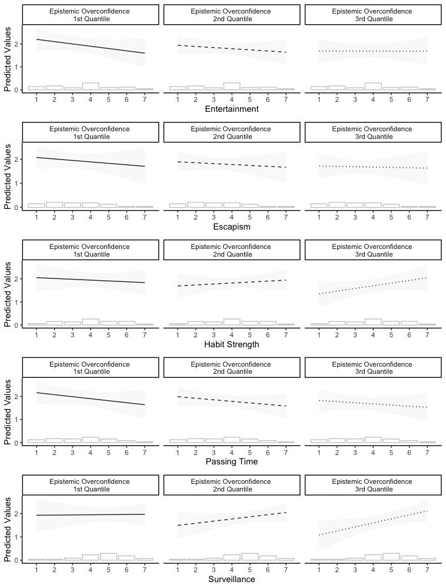

Testing Hypothesis 1 and 2 using the Dutch PollFish Sample
================

-   [Setup](#setup)
-   [Data](#data)
-   [Results](#results)
    -   [Hypothesis 1](#hypothesis-1)
    -   [Hypothesis 2](#hypothesis-2)
    	- [Coefficient Plots](#coefficient-plots)
	- [Predicted Effects](#predicted-effects)

Setup
=====

Load the required packages and source the auxiliary functions from `lib/functions.R`:

``` r
source("../lib/functions.R")
```

Data
====

Load the cleaned data set for the Dutch PollFish Sample


``` r
df <- read_csv("../../data/intermediate/cleaned_NL.csv")
```

Results
====

Hypothesis 1
-------------------

This hypothesis test the main effect of gratifications of the news on algorithmic appreciation.
Using an OLS model, we will examine the effect of `algorithmic appreciation` on `gratifications of the news`, `overconfidence`, `trust in media`, `political efficacy`, `media usage`, `age`, and `gender`. 
We expect more algorithmic appreciations for the gratifications `escapism`, `entertainment`, and `passing time` - signaled by a positive and statistically significant coefficient for these variables.
We expect less algorithmic appreciations for the gratification `surveillance` - signaled by a negative and statistically significant coefficient for the surveillance measure.

```r
# Test H1 - Main Effect of UGT on Algorithmic Appreciation
H1 <- lm(algo_app ~ esc + ent + hs + pt + surv +
           eo + factor(missing_eo) + news + polef + trust + age +
           factor(gender),  data = df)
H1  %>%
  broom::tidy() %>%
  filter(term != "(Intercept)") %>%
  mutate(variable =  c("UGT: Escapism","UGT: Entertainment", "UGT: Habit Strenght",
                       "UGT: Passing Time", "UGT: Surveillance", "Epistemic Overconfidence",
                       "Epistemic Overconfidence: Missing Values", 
                       "News Usage", "Political Efficacy", "Trust in Media",
                       "Age","Gender: Male")) %>%
  select(-term) %>%
  ggplot(aes(y = variable)) +
  stat_dist_halfeyeh(aes(dist = "student_t", arg1 = df.residual(H1), 
                         arg2 = estimate, arg3 = std.error))  +
  labs(x = "", y = "") +
  geom_vline(xintercept = 0, size = .5) +
  theme_bw() +
  ggtitle("DV: Algorithmic Appreciation") +
  theme(plot.title = element_text(hjust = 0.5))
```


Hypothesis 2
-------------------------
This hypothesis test the interaction effect of epistemic overconfidence and gratifications of the news on algorithmic appreciation.
Using an OLS regression, we add an interaction effect between  `epistemic overconfidence` and the `gratifications on the news` to the above described OLS model.
We expect more algorithmic appreciations for the gratification `surveillance` for those with high values on the epistemic overconfidence measure - signaled by a positive and statistically significant coefficient for the interaction term.

### Coefficient Plots
```r
#H2 Interaction Effect Epistemic Overconfidence
H2_1 <-  lm(algo_app ~ esc *eo + ent + hs + pt + surv +
              news + polef + trust + age +
              factor(gender) + factor(missing_eo),  data = df)
f2_1 <- H2_1  %>%
  broom::tidy() %>%
  filter(term != "(Intercept)") %>%
  mutate(variable =  c("UGT: Escapism","Epistemic Overconfidence", "UGT: Entertainment", 
                       "UGT: Habit Strenght", "UGT: Passing Time", "UGT: Surveillance", 
                       "News Usage", "Political Efficacy", "Trust in Media",
                       "Age","Gender: Male", "Epistemic Overconfidence: Missing Values", 
                       " Interaction"),
         id = rep("Escapism", 13)) %>%
  select(-term)

H2_2 <-  lm(algo_app ~ esc + ent*eo + hs + pt + surv +
              news + polef + trust + age +
              factor(gender) + factor(missing_eo),  data = df)
f2_2 <- H2_2  %>%
  broom::tidy() %>%
  filter(term != "(Intercept)") %>%
  mutate(variable =  c("UGT: Escapism", "UGT: Entertainment", "Epistemic Overconfidence",
                       "UGT: Habit Strenght", "UGT: Passing Time", "UGT: Surveillance", 
                       "News Usage","Political Efficacy", "Trust in Media",
                       "Age","Gender: Male", "Epistemic Overconfidence: Missing Values",
                       " Interaction"),
         id = rep("Entertainment", 13)) %>%
  select(-term)

H2_3 <-  lm(algo_app ~ esc + ent + hs*eo + pt + surv +
              news + polef + trust + age +
              factor(gender) + factor(missing_eo),  data = df)
f2_3 <- H2_3  %>%
  broom::tidy() %>%
  filter(term != "(Intercept)") %>%
  mutate(variable =  c("UGT: Escapism", "UGT: Entertainment", "UGT: Habit Strenght", 
                       "Epistemic Overconfidence","UGT: Passing Time", "UGT: Surveillance", 
                       "News Usage", "Political Efficacy", "Trust in Media",
                       "Age","Gender: Male", "Epistemic Overconfidence: Missing Values"," Interaction"),
         id = rep("Habit Strength", 13)) %>%
  select(-term)

H2_4 <-  lm(algo_app ~ esc + ent + hs + pt*eo + surv +
              news + polef + trust + age +
              factor(gender) + factor(missing_eo),  data = df)
f2_4 <- H2_4  %>%
  broom::tidy() %>%
  filter(term != "(Intercept)") %>%
  mutate(variable =  c("UGT: Escapism", "UGT: Entertainment","UGT: Habit Strenght", 
                       "UGT: Passing Time", "Epistemic Overconfidence", "UGT: Surveillance", 
                       "News Usage", "Political Efficacy", "Trust in Media",
                       "Age","Gender: Male", "Epistemic Overconfidence: Missing Values", " Interaction"),
         id = rep("Passing Time", 13)) %>%
  select(-term)

H2_5 <-  lm(algo_app ~ esc + ent + hs + pt + surv*eo +
              news + polef + trust + age +
              factor(gender) + factor(missing_eo),  data = df)
f2_5 <- H2_5  %>%
  broom::tidy() %>%
  filter(term != "(Intercept)") %>%
  mutate(variable =  c("UGT: Escapism", "UGT: Entertainment", "UGT: Habit Strenght", 
                       "UGT: Passing Time", "UGT: Surveillance", "Epistemic Overconfidence",
                       "News Usage", "Political Efficacy", "Trust in Media",
                       "Age","Gender: Male", "Epistemic Overconfidence: Missing Values", " Interaction"),
         id = rep("Surveillance", 13)) %>%
  select(-term)

rbind(f2_1, f2_2, f2_3, f2_4, f2_5) %>%
  ggplot(aes(y = variable)) +
  facet_wrap(~ id, ncol = 2, scales = "free") +
  stat_dist_halfeyeh(aes(dist = "student_t", arg1 = df.residual(H1), 
                         arg2 = estimate, arg3 = std.error))  +
  labs(x = "", y = "") +
  geom_vline(xintercept = 0, size = .5) +
  theme_classic() +
  ggtitle("DV: Algorithmic Appreciation") +
  theme(plot.title = element_text(hjust = 0.5))
 ```


### Predicted Effects

```r
#H2 Interaction Effect for Different Levels of Epistemic Overconfidence
eo.labs <- c("Epistemic Overconfidence \n 1st Quantile", 
             "Epistemic Overconfidence \n 2nd Quantile", 
             "Epistemic Overconfidence \n 3rd Quantile")
names(eo.labs) <- c("0.1", "2.1", "4")

tmp <- tibble(freq = table(df$esc),
              values = 1:7)
esc <- ggeffects::ggpredict(H2_1, terms = c("esc","eo")) %>%
  ggplot(aes(x, predicted)) + 
facet_grid(cols = vars(group), 
          labeller = labeller(group = eo.labs)) +
  geom_line(aes(linetype=group)) +
  geom_ribbon(aes(ymin=conf.low, ymax=conf.high, fill = group), alpha=0.15) +
  scale_fill_manual(values = c("gray85","gray85","gray85")) +
  scale_linetype_manual(values = c("solid", "dashed", "dotted")) +
  scale_x_continuous(breaks = 1:7) +
  theme_classic() +
  labs(x = "Escapism", y = "Predicted Values") +
  theme(legend.title=element_blank()) +
  theme(legend.position="none") +
  geom_bar(data = tmp, aes(x=values, y=freq/400), stat = "identity",
           fill="white", colour = "gray80") 

tmp <- tibble(freq = table(df$ent),
              values = 1:7)
ent <- ggeffects::ggpredict(H2_2, terms = c("ent","eo")) %>%
  ggplot(aes(x, predicted)) + 
  facet_grid(cols = vars(group),
             labeller = labeller(group = eo.labs)) +
  geom_line(aes(linetype=group)) +
  geom_ribbon(aes(ymin=conf.low, ymax=conf.high, fill = group), alpha=0.15) +
  scale_fill_manual(values = c("gray85","gray85","gray85")) +
  scale_linetype_manual(values = c("solid", "dashed", "dotted")) +
  scale_x_continuous(breaks = 1:7) +
  theme_classic() +
  labs(x = "Entertainment", y = "Predicted Values") +
  theme(legend.title=element_blank()) +
  theme(legend.position="none") +
  geom_bar(data = tmp, aes(x=values, y=freq/400), stat = "identity",
           fill="white", colour = "gray80") 

tmp <- tibble(freq = table(df$hs),
              values = 1:7)
hs <- ggeffects::ggpredict(H2_3, terms = c("hs","eo")) %>%
  ggplot(aes(x, predicted)) + 
  facet_grid(cols = vars(group),
             labeller = labeller(group = eo.labs)) +
  geom_line(aes(linetype=group)) +
  geom_ribbon(aes(ymin=conf.low, ymax=conf.high, fill = group), alpha=0.15) +
  scale_fill_manual(values = c("gray85","gray85","gray85")) +
  scale_linetype_manual(values = c("solid", "dashed", "dotted")) +
  scale_x_continuous(breaks = 1:7) +
  theme_classic() +
  labs(x = "Habit Strength", y = "Predicted Values") +
  theme(legend.title=element_blank()) +
  theme(legend.position="none") +
  geom_bar(data = tmp, aes(x=values, y=freq/400), stat = "identity",
           fill="white", colour = "gray80") 

tmp <- tibble(freq = table(df$pt),
              values = 1:7)
pt <- ggeffects::ggpredict(H2_4, terms = c("pt","eo")) %>%
  ggplot(aes(x, predicted)) + 
  facet_grid(cols = vars(group),
             labeller = labeller(group = eo.labs)) +
  geom_line(aes(linetype=group)) +
  geom_ribbon(aes(ymin=conf.low, ymax=conf.high, fill = group), alpha=0.15) +
  scale_fill_manual(values = c("gray85","gray85","gray85")) +
  scale_linetype_manual(values = c("solid", "dashed", "dotted")) +
  scale_x_continuous(breaks = 1:7) +
  theme_classic() +
  labs(x = "Passing Time", y = "Predicted Values") +
  theme(legend.title=element_blank()) +
  theme(legend.position="none") +
  geom_bar(data = tmp, aes(x=values, y=freq/400), stat = "identity",
           fill="white", colour = "gray80") 

tmp <- tibble(freq = table(df$surv),
              values = 1:7)
surv <- ggeffects::ggpredict(H2_5, terms = c("surv","eo")) %>%
  ggplot(aes(x, predicted)) + 
  facet_grid(cols = vars(group),
             labeller = labeller(group = eo.labs)) +
  geom_line(aes(linetype=group)) +
  geom_ribbon(aes(ymin=conf.low, ymax=conf.high, fill = group), alpha=0.15) +
  scale_fill_manual(values = c("gray85","gray85","gray85")) +
  scale_linetype_manual(values = c("solid", "dashed", "dotted")) +
  scale_x_continuous(breaks = 1:7) +
  theme_classic() +
  labs(x = "Surveillance", y = "Predicted Values") +
  theme(legend.title=element_blank()) +
  theme(legend.position="none") +
  geom_bar(data = tmp, aes(x=values, y=freq/400), stat = "identity",
           fill="white", colour = "gray80") 
ggplot2.multiplot(ent, esc, hs, pt, surv, cols=1)
```


