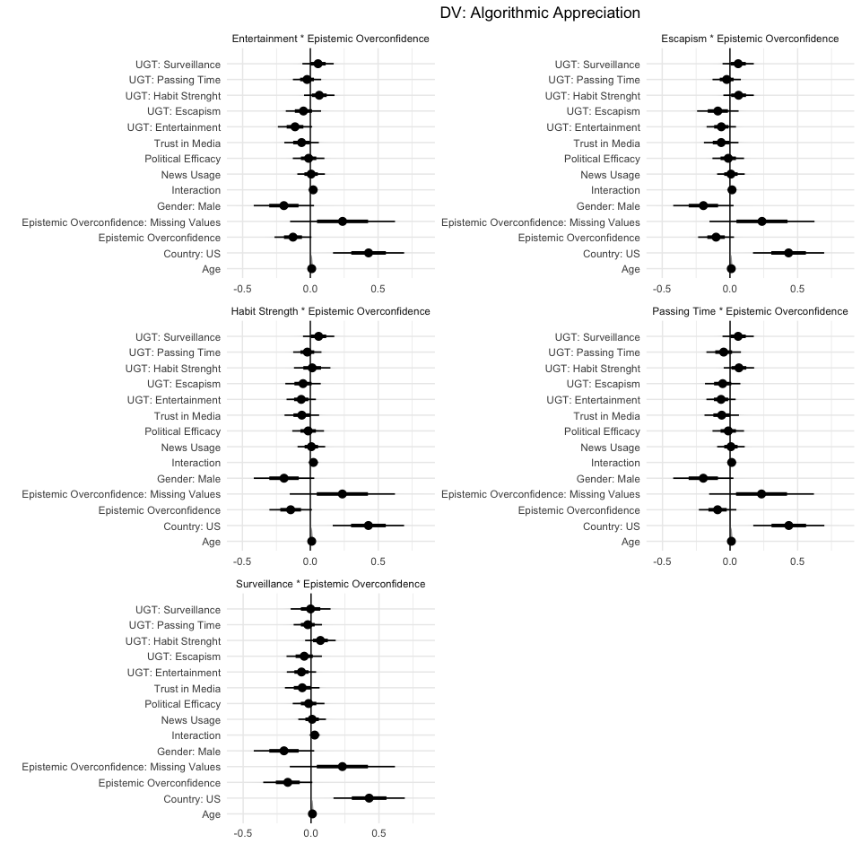

Analysis for Epistemic Overconfidence in Algorithmic News Selection
Paper
================

# Scripts

  - [Required Packages &
    Reproducibility](#required-packages-&-reproducibility)
  - [Load Data](#load-data)
  - [Analysis](#analysis)
      - [H1: Direct Effect of UGT on Algorithmic
        Appreciation](#h1:-direct-effect-of-ugt-on-algorithmic-appreciation)
      - [H2: Interaction UGT \* Epistemic
        Overconfidence](#h2:-interaction-ugt-*-epistemic-overconfidence)
      - [Predicted Effects](#predicted-effects)

## Required Packages & Reproducibility

``` r
rm(list=ls())

renv::snapshot()
```

    ## * The lockfile is already up to date.

``` r
source("../lib/functions.R")
```

## Load Data

``` r
load("../../data/intermediate/cleaned_data.RData") 
df <- df %>%
  mutate(esc = round(esc, 0),
         ent = round(ent, 0),
         hs = round(hs, 0),
         pt = round(pt, 0),
         surv = round(surv, 0))
#  pid = factor(pid, levels = c("None", "Other", "Democrat",
#                                      "Republican")))
```

## Analysis

### H1: Direct Effect of UGT on Algorithmic Appreciation

``` r
#df <- within(df, pid <- relevel(pid, ref = "Other"))
H1 <- lm(algo_app ~ esc + ent + hs + pt + surv +
           eo + factor(missing_eo) + news + polef + trust +
           age + factor(gender) + factor(country),  data = df)
```

<!-- -->

### H2: Interaction UGT \* Epistemic Overconfidence

``` r
#H2 Interaction Effect Epistemic Overconfidence
H2_1 <-  lm(algo_app ~ esc *eo + ent + hs + pt + surv +
            missing_eo + news + polef + trust + age +
            factor(gender) + factor(country),  data = df)

H2_2 <-  lm(algo_app ~ esc + ent*eo + hs + pt + surv +
              factor(missing_eo) + news + polef + trust + age +
              factor(gender) + factor(country),  data = df)

H2_3 <-  lm(algo_app ~ esc + ent + hs*eo + pt + surv +
              factor(missing_eo) + news + polef + trust +
              age + factor(gender) + factor(country),  data = df)

H2_4 <-  lm(algo_app ~ esc + ent + hs + pt*eo + surv +
              factor(missing_eo) + news + polef + trust + 
              age + factor(gender) + factor(country),  data = df)

H2_5 <-  lm(algo_app ~ esc + ent + hs + pt + surv*eo +
              factor(missing_eo) + news + polef + trust + age +
              factor(gender) + factor(country),  data = df)
```

<!-- -->

### Predicted Effects

<!-- -->
