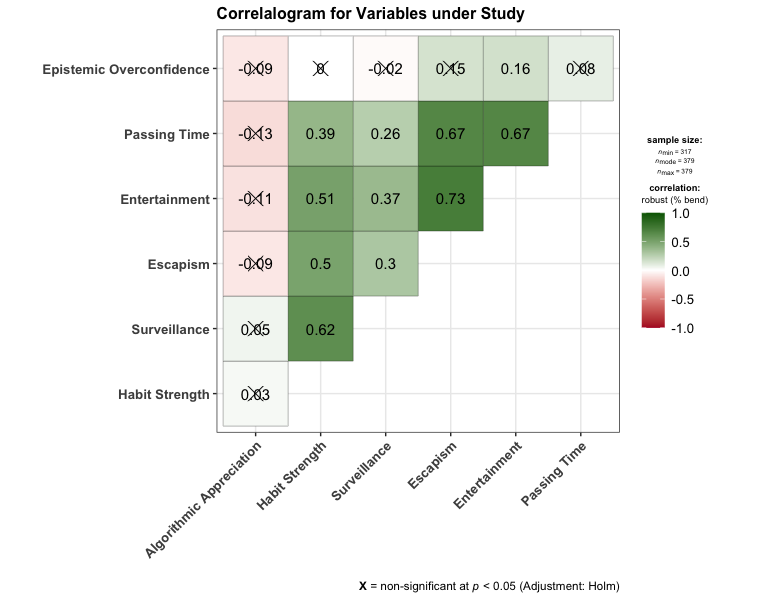
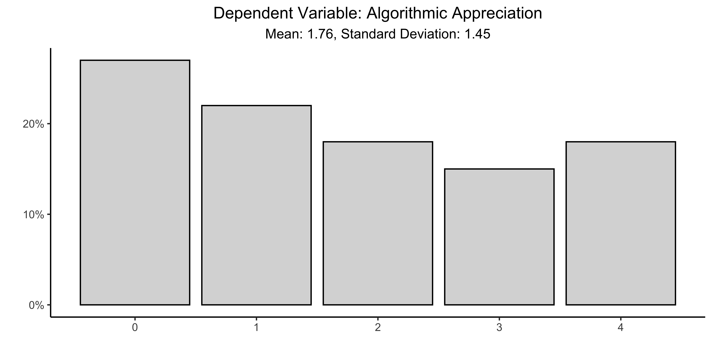
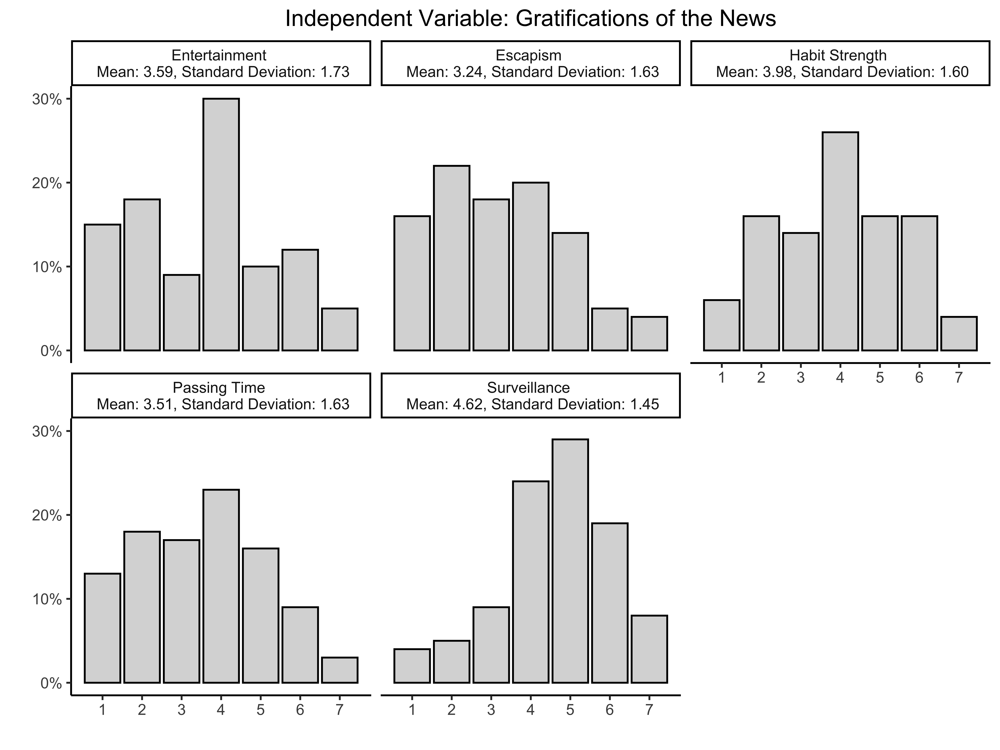
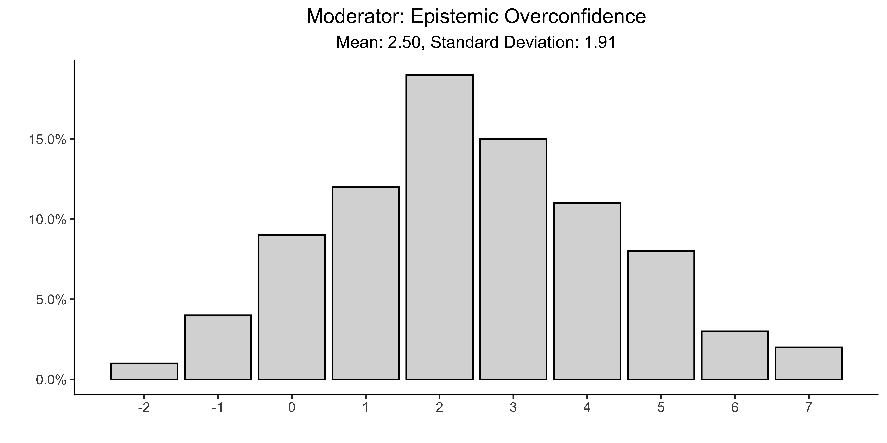
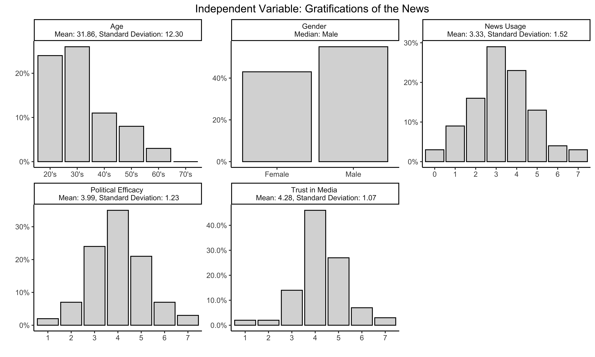

Prepare Data of Dutch PollFish Sample
================

- DESCRIPTION: Clean and construct measures according to PAP (pp. 3--8)
- CREATES: [Cleaned Data for Dutch Sample](../../data/intermediate/cleaned_NL.csv)
-  DEPENDS: [Raw Data from PollFish](../../data/raw-private-encrypted/POLLFISH.csv)

Content
======

-   [Setup](#setup)
-   [Data](#data)
    -   [Scalability](#Scalability)
    -   [Tidy Data](#Tidy-Data)
    -   [Dependent Variable](#Dependent-Variable)
    -   [Independent Variables](#Independent-Variables)
    -   [Moderator](#Moderator)
    -   [Control Variables](#Control-Variables)
- [Missing Data](#Missing-Data)

Setup
=====

Load the required packages and source the auxiliary functions from `src/lib/functions.R`:

``` r
source("src/lib/functions.R")
```
Data
====
-  Requires access to the csv file prepared by PollFish. 
-  [Cleaned data](../../data/intermediate/cleaned_NL.csv) and [codings](00_PrepareData_NL.R) are saved to public folders. 


``` r
df <- read_sav("../../data/raw-private-encrypted/POLLFISH.csv")
```

Scalability
------------
* The gratifications of the news is constructed as an additive scale using a Principal Components Factor Analysis using varimax rotation, similar to Diddi and LaRose (2006), PAP p.9.

```r
# Check Scalability of DV
hs <- df %>%
  select(ugt_1:ugt_4,)
cols <- c(1:4)
hs[,cols] = apply(hs[,cols], 2, function(x) as.numeric(as.character(x)));
hs <- hs[complete.cases(hs), ]
fac_hs <- psych::fa(hs, rotate="varimax", fm="pa", scores="Bartlett")

surv <- df %>%
  select(ugt_5:ugt_11)
cols <- c(1:7)
surv[,cols] = apply(surv[,cols], 2, function(x) as.numeric(as.character(x)));
surv <- surv[complete.cases(surv), ]
fac_surv <- psych::fa(surv, rotate="varimax", fm="pa", scores="Bartlett")

esc <- df %>%
  select(ugt_12:ugt_16)
cols <- c(1:5)
esc[,cols] = apply(esc[,cols], 2, function(x) as.numeric(as.character(x)));
esc <- esc[complete.cases(esc), ]
fac_esc <- psych::fa(esc, rotate="varimax", fm="pa", scores="Bartlett")

pt <- df %>%
  select(ugt_17:ugt_21)
cols <- c(1:5)
pt[,cols] = apply(pt[,cols], 2, function(x) as.numeric(as.character(x)));
pt <- pt[complete.cases(pt), ]
fac_pt <- psych::fa(pt, rotate="varimax", fm="pa", scores="Bartlett")

ent <- df %>%
  select(ugt_22:ugt_23)
cols <- c(1:2)
ent[,cols] = apply(ent[,cols], 2, function(x) as.numeric(as.character(x)));
ent <- ent[complete.cases(ent), ]
fac_ent <- psych::fa(ent, rotate="varimax", fm="pa", scores="Bartlett")

tibble(Scale = c("Habit Strengt", "Surveillance", "Escapism","Passing Time", "Entertainment"),
       `Chi Square` = c(fac_hs[3]$chi, fac_surv[3]$chi, fac_esc[3]$chi, fac_pt[3]$chi, fac_ent[3]$chi),
       Fit = c(fac_hs[10]$fit, fac_surv[10]$fit, fac_esc[10]$fit, fac_pt[10]$fit, fac_ent[10]$fit),
       PA = c(fac_hs[29]$R2, fac_surv[29]$R2, fac_esc[29]$R2, fac_pt[29]$R2, fac_ent[27]$R2))
```

|  Scale		 | Chi Square |	Fit 		  | PA		|
|-------------------- | :-------------:  | :--------------: | :---------------: |
| Habit Strength	| 24.2	     | 0.911 		  | 0.876		|
| Surveillance	| 37.7	     | 0.951 	  | 0.920 		|
| Escapism	| 12.0	     | 0.941 	  | 0.915		|
| Passing Time	| 13.6 	     | 0.938 	  | 0.908		|
| Entertainment	| 00.0	     | 0.961 	  | 0.859		|

- Variables created with an additive scale:
	- News Consumption
	- Trust in News
	- Political Efficacy
```r
#Scalability of Controls
news <- df %>%
  select(mediagebruik_1:mediagebruik_9) 
news <- news[complete.cases(news), ]
news <- psy::cronbach(news)

trust <- df %>%
  select(trust_media_1:trust_media_9)
trust <- trust[complete.cases(trust), ]
trust <- psy::cronbach(trust)

polef <- df %>%
  select(pol_efficacy_1:pol_efficacy_5)
polef <- polef[complete.cases(polef), ]
polef <- psy::cronbach(polef)

tibble(Scale = c("News Usage", "Trust in Media", "Political Efficacy"),
       `Cronbach's Alpha` = c(news[3]$alpha, trust[3]$alpha,polef[3]$alpha))
```

| Scale			| Cronbach's Alpha	|
| -------------------------- | ------------------------- |
| News Usage		| 0.808			|
| Trust in Media		| 0.804			|
| Political Efficacy	| 0.584			|

Tidy Data
-------

``` r
# Mutate data
df <-  df %>%
  mutate(news = round((mediagebruik_1 + mediagebruik_2 + mediagebruik_3 + mediagebruik_4 +
                        mediagebruik_5 + mediagebruik_6 + mediagebruik_7 + mediagebruik_8 +
                        mediagebruik_9)/9, digits = 0),
         hs = round((ugt_1 + ugt_2 + ugt_3 + ugt_4)/4, digits = 0),
         surv = round((ugt_5 + ugt_6 + ugt_7 + ugt_8  + ugt_9  + ugt_10 + ugt_11)/7, digits = 0),
         esc = round((ugt_12 + ugt_13 + ugt_14 + ugt_15 + ugt_16)/5, digits = 0),
         pt = round((ugt_17 + ugt_18 + ugt_19 + ugt_20 + ugt_21)/5, digits = 0),
         ent = round((ugt_22 + ugt_23)/2, digits = 0),
         algo_app = (rename3(df$alg_app1_1) + rename3(df$alg_app2_1) + rename3(df$alg_app3_1) +
                       rename3(df$alg_app4_1)),
         trust = round((trust_media_1 + trust_media_2  + trust_media_3 + trust_media_4 +
                        trust_media_5 + trust_media_6 + trust_media_7 + trust_media_8 + 
                        trust_media_9)/9,digits = 0),
         polef = round((pol_efficacy_1 + pol_efficacy_2 + pol_efficacy_5)/3, 
                       digits = 0),
         DK1 = str_to_lower(DK1, locale = "nl"),
         DK1 = ifelse(DK1 == "2", 1,
               ifelse(DK1 == "2e", 1,
               ifelse(DK1 == "2de", 1,
               ifelse(DK1 == "2de plaats", 1,
               ifelse(DK1 == "2e plaats",1,
               ifelse(DK1 == "de tweede", 1,
               ifelse(DK1 == "de tweede plaats", 1,
               ifelse(DK1 == "in de tweede plaats", 1,
               ifelse(DK1 == "op de tweede plaats", 1,
               ifelse(DK1 == "plek 2", 1,
               ifelse(DK1 == "tweede", 1, 0))))))))))),
         DK2 = ifelse(DK2 == "8", 1,
               ifelse(DK2 == "8 schapen", 1,
               ifelse(DK2 == "8 schapwn", 1,
               ifelse(DK2 == "Acht", 1, 0)))),
         DK3 = str_to_lower(DK3),
         DK3 = ifelse(DK3 == "emily", 1,
               ifelse(DK3 == "emilu", 1,
               ifelse(DK3 == "emily's", 1,
               ifelse(DK3 == "emily s", 1, 0)))),
         DK4 = str_to_lower(DK4),
         DK4 = ifelse(DK4 == "0", 1,
               ifelse(DK4 == "0 als het een gat is waar geen vuil in zit", 1,
               ifelse(DK4 == "een gat is leeg", 1,
               ifelse(DK4 == "gat is leeg, dus geen vuil", 1,
               ifelse(DK4 == "geen vuil, want het is een gat", 1,
               ifelse(DK4 == "geen, want het is een gat", 1, 
               ifelse(DK4 == "nee", 1,
               ifelse(DK4 == "niets", 1,
               ifelse(DK4 == "nul", 1, 0))))))))),     
         DK5 = ifelse(DK5 == ".05", 1,
               ifelse(DK5 == "£0,05", 1,
               ifelse(DK5 == "€0,05", 1,
               ifelse(DK5 == "€0.05", 1,
               ifelse(DK5 == "0,05", 1,
               ifelse(DK5 == " 0,05 aangezien ik de koers van euro 1,10 naar dollar niet weet kan ik dit niet met zekerheid zeggen", 1, 
               ifelse(DK5 == "0,05 dollar", 1,
               ifelse(DK5 == "0,05 eurocent", 1,
               ifelse(DK5 == "0.05", 1,
               ifelse(DK5 == "5 cent", 1,
               ifelse(DK5 == "5 dollar cent", 1,
               ifelse(DK5 == "Ik ken de wisselkoers van Euro naar Dollar en vice versa op het moment niet. Maar er vanuit gaande dat er maar met een soort valuta mag worden gerekend dan kost de bal: 5 cent.",1,
                      0)))))))))))),
         DK6 = str_to_lower(DK6),
         DK6 = ifelse(DK6 == "5 min", 1,
               ifelse(DK6 == "5 min.", 1,
               ifelse(DK6 == "5 minuten", 1,
               ifelse(DK6=="5min", 1,
               ifelse(DK6=="5minuten", 1,
               ifelse(DK6=="vijf", 1, 0)))))),
         DK7 = str_to_lower(DK7),
         DK7 = str_replace(df$DK7, "47", "1"),
         DK7 = ifelse(DK7 == "1", 1, 0),
         correct = (DK1 + DK2 + DK3 + DK4 + DK5 + DK6 + DK7),
         eo = Overconfidence - correct,
         gender = recode(Gender, `0` = "Male", `1` = "Female"),
         gender = na_if(gender, 99),
         gender = factor(gender, levels = c("Female", "Male")),
         age = Age,
         age = na_if(age, "812"),
         age = na_if(age, "a"),         
         age = na_if(age, "asd"),
         age = na_if(age, "Dbn"),
         age = na_if(age, "eg"),
         age = na_if(age, "Gcc"),
         age = na_if(age, "i"),
         age = na_if(age, "Ja"),
         age = na_if(age, "nee"),
         age = na_if(age, "yes"),
         age = na_if(age, "Zek"),
         age = as.numeric(age),
         ResponseId = V1
         ) %>%
  select(ResponseId, news, hs, surv, esc, pt, ent, 
         algo_app, trust, polef, eo, gender, age) %>%
  filter(age >17)

#Check Correlations
# as a default this function outputs a correlation matrix plot
df%>%
  select(algo_app, hs, surv, esc, ent, pt, eo) %>%
  ggstatsplot::ggcorrmat(
    type = "robust", # correlation method
    sig.level = 0.05, # threshold of significance
    p.adjust.method = "holm", # p-value adjustment method for multiple comparisons
    cor.vars = c(algo_app:eo), # a range of variables can be selected
    cor.vars.names = c(
      "Algorithmic Appreciation", # variable names
      "Habit Strength",
      "Surveillance",
      "Escapism",
      "Entertainment",
      "Passing Time",
      "Epistemic Overconfidence"
    ),
    matrix.type = "upper", # type of visualization matrix
    colors = c("#B2182B", "white", "darkgreen"),
    title = "Correlalogram for Variables under Study",
  )
         
```



Dependent Variable
 -------
* Algorithmic Appreciation

 ``` r
##  Dependent Variable
tibble(values = round(table(df$algo_app)/dim(df)[1],2),
       algo_app = 0:4) %>%
  ggplot(aes(x = algo_app, y = values)) +
  geom_col(fill = "gray85", colour = "black") +
  theme_classic() + 
  theme(plot.title = element_text(hjust = 0.5),
        plot.subtitle = element_text(hjust = 0.5)) +
  scale_y_continuous(labels = scales::percent) +
  labs(x = "", y="", title = "Dependent Variable: Algorithmic Appreciation",
       subtitle = "Mean: 1.76, Standard Deviation: 1.45")
ggsave("../../report/figures/Distributions_DV_NL.png", width=8, height=4, dpi=900)

```



Independent Variables
-------
- Gratifications of the News (**H1**) 
	- Entertainment
	- Escapisme
	- Habit Strength
	- Passing Time
	- Surveillance

 ``` r
##  Independent Variables
rbind(tibble(freq = round(table(df$hs)/dim(df)[1],2),
             values = 1:7,
             id = "Habit Strength \n Mean: 3.98, Standard Deviation: 1.60"), 
      tibble(freq = round(table(df$surv)/dim(df)[1],2),
             values = 1:7,
             id = "Surveillance \n Mean: 4.62, Standard Deviation: 1.45"),
      tibble(freq = round(table(df$esc)/dim(df)[1],2),
             values = 1:7,
             id = "Escapism \n Mean: 3.24, Standard Deviation: 1.63"),
      tibble(freq = round(table(df$pt)/dim(df)[1],2),
             values = 1:7,
             id = "Passing Time \n Mean: 3.51, Standard Deviation: 1.63"),
      tibble(freq = round(table(df$ent)/dim(df)[1],2),
             values = 1:7,
             id = "Entertainment \n Mean: 3.59, Standard Deviation: 1.73")) %>%
  ggplot(aes(x = values, y = freq)) +
  geom_col(fill = "gray85", colour = "black") +
  theme_classic() + 
  theme(plot.title = element_text(hjust = 0.5)) +
  facet_wrap(~ id, ncol = 3) +
  scale_y_continuous(labels = scales::percent) +
  scale_x_continuous(breaks = 1:7) +
  labs(x = "", y="", title = "Independent Variable: Gratifications of the News") 
ggsave("../../report/figures/Distributions_IV_NL.png", width=8, height=6, dpi=900)
```




Moderator
-------
- Epistemic Overconfidence (**H2**) 

 ``` r
##Moderator
tibble(values = round(table(df$eo)/dim(df)[1],2),
       eo = c(-2:7)) %>%
  ggplot(aes(x = eo, y = values)) +
  geom_bar(stat = "identity", fill = "gray85", colour = "black") +
  theme_classic() + 
  theme(plot.title = element_text(hjust = 0.5),
        plot.subtitle = element_text(hjust = 0.5)) +
  scale_y_continuous(labels = scales::percent) +
  scale_x_continuous(breaks = -6:7) +
  labs(x = "", y="", title = "Moderator: Epistemic Overconfidence",
       subtitle = "Mean: 2.50, Standard Deviation: 1.91") 
ggsave("../../report/figures/Distributions_Moderator_NL.png", width=8, height=4, dpi=900)

```




Control Variables
-------
- Trust in Media
- News Usage
- Political Efficacy
- Gender
- Age

 ``` r
# Controls
df <- df%>%
  mutate(age_group = ifelse(age > 21 & age < 30, "20's",
                     ifelse(age > 29 & age < 40, "30's",
                     ifelse(age > 39 & age < 50, "40's",
                     ifelse(age > 49 & age < 60, "50's",
                     ifelse(age > 59 & age < 70, "60's",
                     ifelse(age > 69 & age < 80, "70's", NA)))))))
         
rbind(tibble(freq = round(table(df$trust)/dim(df)[1],2),
             values = 1:7,
             id = "Trust in Media \n Mean: 4.28, Standard Deviation: 1.07"), 
      tibble(freq = round(table(df$news)/dim(df)[1],2),
             values = 0:7,
             id = "News Usage \n Mean: 3.33, Standard Deviation: 1.52"),
      tibble(freq = round(table(df$polef)/dim(df)[1],2),
             values = 1:7,
             id = "Political Efficacy \n Mean: 3.99, Standard Deviation: 1.23"),
      tibble(freq = round(table(df$gender)/dim(df)[1],2),
             values = levels(df$gender),
             id = "Gender \n Median: Male"),
      tibble(freq = round(table(df$age_group)/dim(df)[1],2),
             values = c("20's", "30's", "40's", "50's", "60's", "70's"),
             id = "Age \n Mean: 31.86, Standard Deviation: 12.30")) %>%
  ggplot(aes(x = values, y = freq)) +
  facet_wrap(~ id, ncol = 3, scales = "free") +
  geom_col(fill = "gray85", colour = "black") +
  theme_classic() + 
  theme(plot.title = element_text(hjust = 0.5)) +
  scale_y_continuous(labels = scales::percent) +
  #scale_x_continuous(breaks = 1:7) +
  labs(x = "", y="", title = "Independent Variable: Gratifications of the News") 
ggsave("../../report/figures/Distributions_Controls_NL.png", width=10, height=6, dpi=900)

```


Missing Data
====
We employ the following criteria: 

- If 10\% or less of the values on the dimension are missing, then we re-code the missing values to the overall mean. 
- If 11\% or more of the values on the dimension are missing, then we re-code the missing values to a constant (for instance 0) and include a dummy variable indicating whether the response on the covariate was missing or not.

```r
#Check Missing Values
tibble(Covariate = c("Algorithmic Appreciation", "UGT: Entertainment",
                     "UGT: Escapism", "UGT: Habit Strength", "UGT: Passing Time", 
                     "UGT: Surveillance","Epistemic Overconfidence",
                     "Age","Gender","News Usage", "Political Efficacy",
                     "Trust in Media"),
       Percentage =c(round(sum(is.na(df$algo_app))/prod(dim(df)[1]),2),
                     round(sum(is.na(df$ent))/prod(dim(df)[1]),2),
                     round(sum(is.na(df$esc))/prod(dim(df)[1]),2),
                     round(sum(is.na(df$hs))/prod(dim(df)[1]),2),
                     round(sum(is.na(df$pt))/prod(dim(df)[1]),2),
                     round(sum(is.na(df$surv))/prod(dim(df)[1]),2),
                     round(sum(is.na(df$eo))/prod(dim(df)[1]),2),
                     round(sum(is.na(df$age))/prod(dim(df)[1]),2),
                     round(sum(is.na(df$gender))/prod(dim(df)[1]),2),
                     round(sum(is.na(df$news))/prod(dim(df)[1]),2),
                     round(sum(is.na(df$polef))/prod(dim(df)[1]),2),
                     round(sum(is.na(df$trust))/prod(dim(df)[1]),2)))
```

| Covariate 					| Percentage	|
|------------------------------------------------|---------------------|
| Algorithmic Appreciation			| 0			|   
| UGT: Entertainment            		| 0.01		|
| UGT: Escapism                  		| 0.01		|   
| UGT: Habit Strength            		| 0.01		|   
| UGT: Passing Time              		| 0.01  		|
| UGT: Surveillance              		| 0.01   		|
| Epistemic Overconfidence       	| 0.17		|
| Age                            			| 0			|
| Gender                         			| 0.02		|
| News Usage                     		| 0   			|
| Political Efficacy             			| 0   			|
| Trust in Media                 			| 0			|
  
 We recode the missing values of the variables `UGT: Entertainment`, `UGT: Escapism`, `UGT: Habit Strength`, `UGT: Passing Time`, `UGT: Surveillance`, and `Gender`,  to the mean value of the respective variables.

 ```r
# Change missing values in variables where missings are <10% to mean
df <- df %>%
  select(-age_group) %>%
  mutate(ent = tidyr::replace_na(ent, round(mean(df$ent, na.rm=T),0)),
         esc = tidyr::replace_na(esc, round(mean(df$esc, na.rm=T),0)),
         hs = tidyr::replace_na(hs, round(mean(df$hs, na.rm=T),0)),
         pt = tidyr::replace_na(pt, round(mean(df$pt, na.rm=T),0)),
         surv = tidyr::replace_na(surv, round(mean(df$surv, na.rm=T),0)),
         gender = tidyr::replace_na(gender, "Male"))
``` 
 We recode the missing values of the variable `Epistemic Overconfidence` to 0 and include the variable `Missing_eo` to the data, indicating whether the response on the covariate was missing (value of 1) or not (value of 0).

```r
# Change missing values in variables where missings are >10% 

df <- df %>%
 mutate(Missing_eo = ifelse(is.na(eo), 1, 0),
        eo = tidyr::replace_na(eo, 0))
``` 
  
 Save data to `data/intermediate` and make public.
 
 ```r
 #save data
 write_csv(df, "../../data/intermediate/cleaned_NL.csv")         

 ```
 
