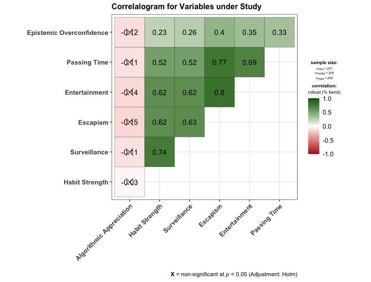
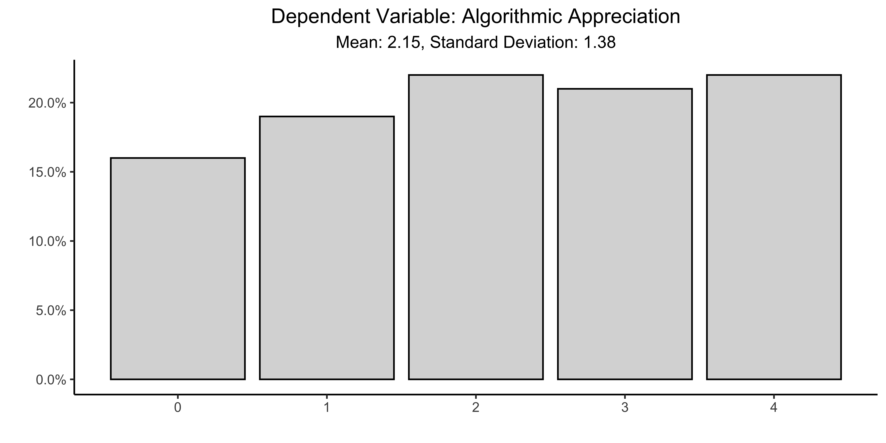
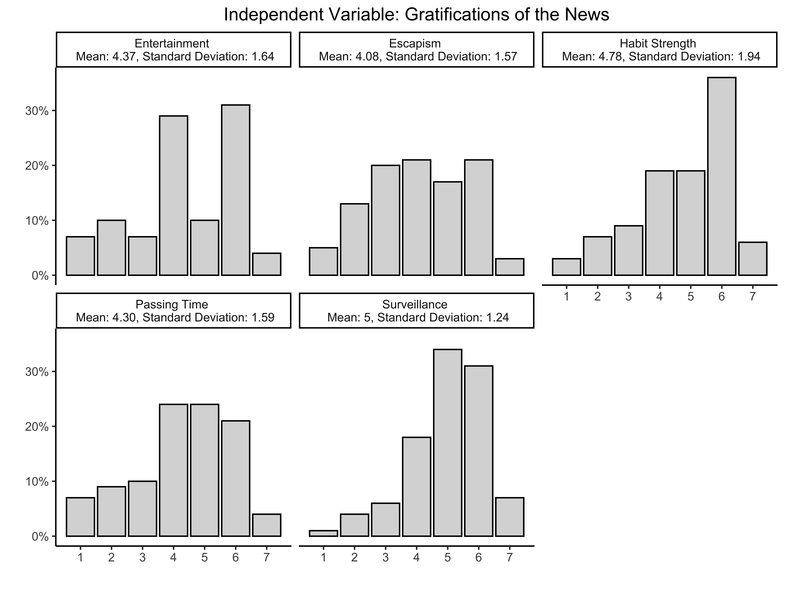
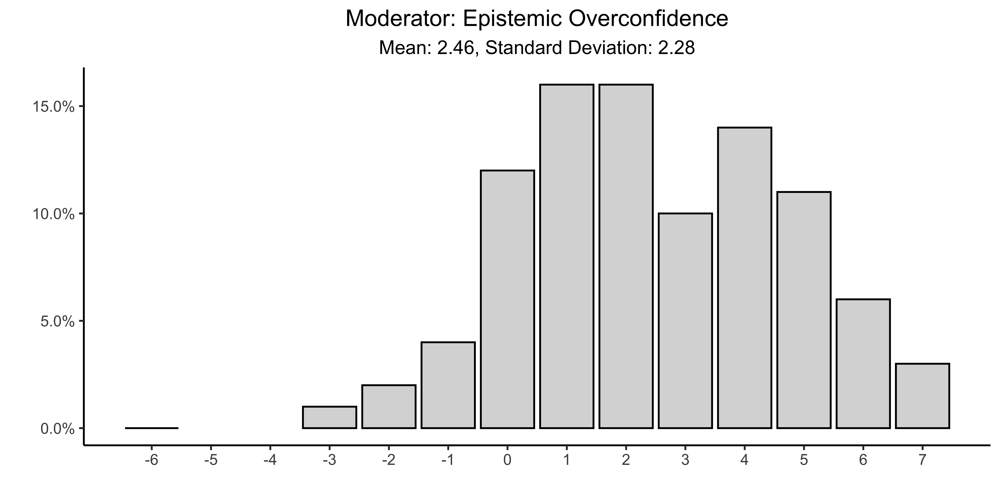

Prepare Data of US MTurk Sample
================

- DESCRIPTION: Clean and construct measures according to PAP (pp. 3--8)
- CREATES: [Cleaned Data for US Sample](../../data/intermediate/cleaned_us.csv)
-  DEPENDS: [Raw Data from MTurk](../../data/raw-private-encrypted/US_MTURK.csv)

Content
======

-   [Setup](#setup)
-   [Data](#data)
    -   [Scalability](#Scalability)
    -   [Tidy Data](#Tidy-Data)
    -   [Dependent Variable](#Dependent-Variable)
    -   [Independent Variables](#Independent-Variables)
    -   [Moderator](#Moderator)
    -   [Control Variables](#Control-Variables)
- [Missing Data](#Missing-Data)

Setup
=====

Load the required packages and source the auxiliary functions from `src/lib/functions.R`:

``` r
source("src/lib/functions.R")
```
Data
====
-  Requires access to the csv file prepared by MTurk. 
-  [Cleaned data](../../data/intermediate/cleaned_us.csv) and [codings](src/data-processing) are saved to public folders. 


``` r
df <- read_sav("../../data/raw-private-encrypted/MTURK_US.csv")
```

Scalability
------------
* The gratifications of the news is constructed as an additive scale using a Principal Components Factor Analysis using varimax rotation, similar to Diddi and LaRose (2006), PAP p.9.

```r
# Check Scalability of Uses and Gratifications of the News
hs <- df[c("Q1_1", "Q1_2", "Q1_3", "Q1_4", "Q1_5")]
cols <- c(1:5)
hs[,cols] = apply(hs[,cols], 2, function(x) as.numeric(as.character(x)));
hs <- hs[complete.cases(hs), ]
fac_hs <- psych::fa(hs, rotate="varimax", fm="pa", scores="Bartlett")

surv <- df[c("Q1_5", "Q1_6", "Q1_7", "Q1_8", "Q1_9", "Q1_10", "Q1_11")]
cols <- c(1:7)
surv[,cols] = apply(surv[,cols], 2, function(x) as.numeric(as.character(x)));
surv <- surv[complete.cases(surv), ]
fac_surv <- psych::fa(surv, rotate="varimax", fm="pa", scores="Bartlett")

esc <- df[c("Q1_12", "Q1_13", "Q1_14", "Q1_15", "Q1_16")]
cols <- c(1:5)
esc[,cols] = apply(esc[,cols], 2, function(x) as.numeric(as.character(x)));
esc <- esc[complete.cases(esc), ]
fac_esc <- psych::fa(esc, rotate="varimax", fm="pa", scores="Bartlett")

pt <- df[c("Q1_17", "Q1_18", "Q1_19", "Q1_20", "Q1_21")]
cols <- c(1:5)
pt[,cols] = apply(pt[,cols], 2, function(x) as.numeric(as.character(x)));
pt <- pt[complete.cases(pt), ]
fac_pt <- psych::fa(pt, rotate="varimax", fm="pa", scores="Bartlett")

ent <- df[c("Q1_22", "Q1_23")]
cols <- c(1:2)
ent[,cols] = apply(ent[,cols], 2, function(x) as.numeric(as.character(x)));
ent <- ent[complete.cases(ent), ]
fac_ent <- psych::fa(ent, rotate="varimax", fm="pa", scores="Bartlett")

tibble(Scale = c("Habit Strengt", "Surveillance", "Escapism","Passing Time", "Entertainment"),
       `Chi Square` = c(fac_hs[3]$chi, fac_surv[3]$chi, fac_esc[3]$chi, fac_pt[3]$chi, fac_ent[3]$chi),
       Fit = c(fac_hs[10]$fit, fac_surv[10]$fit, fac_esc[10]$fit, fac_pt[10]$fit, fac_ent[10]$fit),
       PA = c(fac_hs[29]$R2, fac_surv[29]$R2, fac_esc[29]$R2, fac_pt[29]$R2, fac_ent[27]$R2))
```

|  Scale		 | Chi Square |	Fit 		  | PA		|
|-------------------- | --------------- | ---------------- | ----------------- |
| Habit Strengt 	| 6.04	     | 0.811 		  | 0.825		|
| Surveillance	| 24.5	     | 0.789 	  | 0.851 		|
| Escapism	| 9.39	     | 0.742 	  | 0.826		|
| Passing Time	| 22.8 	     | 0.807 	  | 0.874		|
| Entertainment	| 0.0000857   | 0.785 	  | 0.652		|

- Variables created with an additive scale:
	- News Consumption
	- Trust in News
	- Political Efficacy
```r
#Scalability of Controls
news <- df %>%
  select(Q20_1:Q20_5) %>%
  mutate(Q20_1 = rename1(df$Q20_1),
         Q20_2 = rename1(df$Q20_2),
         Q20_3 = rename1(df$Q20_3),
         Q20_4 = rename1(df$Q20_4),
         Q20_5 = rename1(df$Q20_5))
news <- news[complete.cases(news), ]
news <- psy::cronbach(news)

trust <- df %>%
  select(Q23_1:Q23_9) %>%
  mutate(Q23_1 = rename2(df$Q23_1),
         Q23_2 = rename2(df$Q23_2),
         Q23_3 = rename2(df$Q23_3),
         Q23_4 = rename2(df$Q23_4),
         Q23_5 = rename2(df$Q23_5),
         Q23_6 = rename2(df$Q23_6),
         Q23_7 = rename2(df$Q23_7),
         Q23_8 = rename2(df$Q23_8),
         Q23_9 = rename2(df$Q23_9))
trust <- trust[complete.cases(trust), ]
trust <- psy::cronbach(trust)

polef <- df %>%
  select(Q23_1.1:Q23_3.1) %>%
  mutate(Q23_1.1 = rename2(df$Q23_1.1),
         Q23_2.1 = rename2(df$Q23_2.1),
         Q23_3.1 = rename2(df$Q23_3.1))
polef <- polef[complete.cases(polef), ]
polef <- psy::cronbach(polef)

tibble(Scale = c("News Usage", "Trust in Media", "Political Efficacy"),
       `Cronbach's Alpha` = c(news[3]$alpha, trust[3]$alpha,polef[3]$alpha))
```

| Scale			| Cronbach's Alpha	|
| -------------------------- | ------------------------- |
| News Usage		| 0.707			|
| Trust in Media		| 0.846			|
| Political Efficacy	| 0.361			|

Tidy Data
-------
``` r
# Mutate data
df <-  df %>%
  mutate(news = round((rename1(df$Q20_1) + rename1(df$Q20_2) + rename1(df$Q20_3) +
                         rename1(df$Q20_4) + rename1(df$Q20_5))/5, digits = 0),
         hs = round(rename2(df$Q1_1) + rename2(df$Q1_2) + rename2(df$Q1_3) +
                      rename2(df$Q1_4)/4, digits = 0),
         surv = round((rename2(df$Q1_5) + rename2(df$Q1_6) + rename2(df$Q1_7) + 
                         rename2(df$Q1_8) + rename2(df$Q1_9) + rename2(df$Q1_10) +
                         rename2(df$Q1_11))/7, digits = 0),
         esc = round((rename2(df$Q1_12) + rename2(df$Q1_13) + rename2(df$Q1_14) + 
                        rename2(df$Q1_15) + rename2(df$Q1_16))/5, digits = 0),
         pt = round((rename2(df$Q1_17) + rename2(df$Q1_18) + rename2(df$Q1_19) + 
                       rename2(df$Q1_20) + rename2(df$Q1_21))/5, digits = 0),
         ent = round((rename2(df$Q1_22) + rename2(df$Q1_23))/2, digits = 0),
         algo_app = (rename3(df$Q3_1) + rename3(df$Q4_1) + rename3(df$Q6_1) +
                       rename3(df$Q8_1)),
         trust = round((rename2(df$Q23_1) + rename2(df$Q23_2) + rename2(df$Q23_3) +
                        rename2(df$Q23_4) + rename2(df$Q23_5) + rename2(df$Q23_6) +
                        rename2(df$Q23_7) + rename2(df$Q23_8) + rename2(df$Q23_9))/9, 
                       digits = 0),
         polef = round((rename2(df$Q23_1.1) + rename2(df$Q23_2.1) + rename2(df$Q23_3.1))/3, 
                       digits = 0),
         Q11 = str_to_lower(Q11, locale = "en"),
         Q11 = ifelse(Q11 == "second", 1,
               ifelse(Q11 == "second place", 1,
               ifelse(Q11 == "2", 1,
               ifelse(Q11 == "2nd", 1,
               ifelse(Q11 == "second place. if you guessed first place, the person in first place is still there.",
                       1, 0))))),
         Q12 = ifelse(Q12 == "8", 1, 0),
         Q14 = str_to_lower(Q14),
         Q14 = ifelse(Q14 == "emily", 1,
               ifelse(Q14 == "emily april may", 1, 0)),
         Q15 = str_to_lower(Q15),
         Q15 = ifelse(Q15 == "0", 1,
               ifelse(Q15 == "0 cubic feet", 1,
               ifelse(Q15 == "none", 1,
               ifelse(Q15 == "zero", 1,
               ifelse(Q15 == "there is no dirt in a hole", 1,
               ifelse(Q15 == "there's no dirt in a hole", 1, 0)))))),     
         Q16 = ifelse(Q16 == ".05", 1,
               ifelse(Q16 == "$0.05", 1,
               ifelse(Q16 == "0.05", 1,
               ifelse(Q16 == "05", 1,
               ifelse(Q16 == "5", 1,
               ifelse(Q16 == "5 cents", 1, 0)))))),
         Q17 = str_to_lower(Q17),
         Q17 = str_replace(df$Q17, "5", "1"),
         Q17 = ifelse(Q17 == "1", 1, 0),
         Q18 = str_to_lower(Q18),
         Q18 = str_replace(df$Q18, "47", "1"),
         Q18 = ifelse(Q18 == "1", 1, 0),
         correct = (Q11 + Q12 + Q14 + Q15 + Q16 + Q17 + Q18),
         eo = Q19 - correct,
         pid = Q31,
         pid = recode(Q31, "Independent"= "Other", "Something Else" = "Other"),
         pid =factor(pid, levels = c("Other", "Democrat", "Republican")),
         gender = Q37,
         gender = recode(Q37, "Transgender Female" = "Female"),
         gender = na_if(gender, "Prefer not to answer"),
         gender = factor(gender, levels = c("Female", "Male")),
         age = (2019 - Q39)
         ) %>%
  select(ResponseId, news, hs, surv, esc, pt, ent, 
         algo_app, trust, polef, eo, pid, gender, age) 
         
#Check Correlations between Main Variables
df%>%
  select(algo_app, hs, surv, esc, ent, pt, eo) %>%
  ggstatsplot::ggcorrmat(
    type = "robust", # correlation method
    sig.level = 0.05, # threshold of significance
    p.adjust.method = "holm", # p-value adjustment method for multiple comparisons
    cor.vars = c(algo_app:eo), # a range of variables can be selected
    cor.vars.names = c(
      "Algorithmic Appreciation", # variable names
      "Habit Strength",
      "Surveillance",
      "Escapism",
      "Entertainment",
      "Passing Time",
      "Epistemic Overconfidence"
    ),
    matrix.type = "upper", # type of visualization matrix
    colors = c("#B2182B", "white", "darkgreen"),
    title = "Correlalogram for Variables under Study",
  )         
         
```



Dependent Variable
 -------
* Algorithmic Appreciation

 ``` r
# Dependent Variable
tibble(values = round(table(df$algo_app)/dim(df)[1],2),
       algo_app = 0:4) %>%
  ggplot(aes(x = algo_app, y = values)) +
  geom_col(fill = "gray85", colour = "black") +
  theme_classic() + 
  theme(plot.title = element_text(hjust = 0.5)) +
  scale_y_continuous(labels = scales::percent) +
  labs(x = "", y="", title = "Dependent Variable: Algorithmic Appreciation") 
ggsave("../../report/figures/Distributions_DV_US.png", width=8, height=4, dpi=900)
```


Independent Variable
-------
- Gratifications of the News (**H1**) 
	- Entertainment
	- Escapisme
	- Habit Strength
	- Passing Time
	- Surveillance

 ``` r
# Independent Variables
rbind(tibble(freq = round(table(df$hs)/dim(df)[1],2),
             values = 1:7,
             id = "Habit Strength"), 
      tibble(freq = round(table(df$surv)/dim(df)[1],2),
             values = 1:7,
             id = "Surveillance"),
      tibble(freq = round(table(df$esc)/dim(df)[1],2),
             values = 1:7,
             id = "Escapism"),
      tibble(freq = round(table(df$pt)/dim(df)[1],2),
             values = 1:7,
             id = "Passing Time"),
      tibble(freq = round(table(df$ent)/dim(df)[1],2),
             values = 1:7,
             id = "Entertainment")) %>%
  ggplot(aes(x = values, y = freq)) +
  geom_col(fill = "gray85", colour = "black") +
  theme_classic() + 
  theme(plot.title = element_text(hjust = 0.5)) +
  facet_wrap(~ id, ncol = 3) +
  scale_y_continuous(labels = scales::percent) +
  scale_x_continuous(breaks = 1:7) +
  labs(x = "", y="", title = "Independent Variable: Gratifications of the News") 
ggsave("../../report/figures/Distributions_IV_US.png", width=8, height=6, dpi=900)
```




Moderator
-------
- Epistemic Overconfidence (**H2**) 

 ``` r
#Moderator
tibble(values = round(table(df$eo)/dim(df)[1],2),
       eo = c(-6,-3:7)) %>%
  ggplot(aes(x = eo, y = values)) +
  geom_bar(stat = "identity", fill = "gray85", colour = "black") +
  theme_classic() + 
  theme(plot.title = element_text(hjust = 0.5)) +
  scale_y_continuous(labels = scales::percent) +
  scale_x_continuous(breaks = -6:7) +
  labs(x = "", y="", title = "Moderator: Epistemic Overconfidence") 
ggsave("../../report/figures/Distributions_Moderator_US.png", width=8, height=4, dpi=900)
```




Control Variables
-------
- Trust in Media
- News Usage
- Political Efficacy
- Party ID
- Gender
- Age

 ``` r
 # Controls
 
```


Missing Data
====
We employ the following criteria: 

- If 10\% or less of the values on the dimension are missing, then we re-code the missing values to the overall mean. 
- If 11\% or more of the values on the dimension are missing, then we re-code the missing values to a constant (for instance 0) and include a dummy variable indicating whether the response on the covariate was missing or not.

```r

```

| Covariate 					| Percentage	|
|------------------------------------------------|---------------------|
| Likeability CDA                 		| 0.06 		|
| Likeability VVD                 		| 0.05 		|
| Likeability FvD                  		| 0.1 			|
| Perceived Extremity CDA 		| 0.06		|
| Perceived Extremity VVD	 	| 0.06		|
| Perceived Extremity FvD  		| 0.1 			|
| Popularity of FvD in Eyes of Others | 0.1			|
| Treatment                               		| 0   			|
| Left-Right Self Placement            	| 0.02 		|
| Left-Right Placement CDA      		| 0.17 		|
| Left-Right Placement FvD       		| 0.19 		|
| Left-Right Placement VVD     		| 0.16 		|
| Turnout                      			| 0   			|
| Vote Choice               			| 0    			|
| Gender                    	 		| 0   			|
| Age                          			| 0   			|
| Education               				| 0 			|
  
 We recode the missing values of the variables XXX to the mean value of the respective variables.

 ```r
# Change missing values in variables where missings are <10% to mean

``` 
 
 We recode the missing values of the variables XXX to XXX and  include the variables XXX to the data, indicating whether the response on the covariate was missing (value of `1`) or not (value of `0`).
 
 ```r
# Recode missing values to 5 and add dummies

```  
 
 Save data to `data/intermediate` and make public.
 
 ```r
 #save data
 
 write_csv(df, "../../data/intermediate/cleaned_US.csv")         

 ```
 
