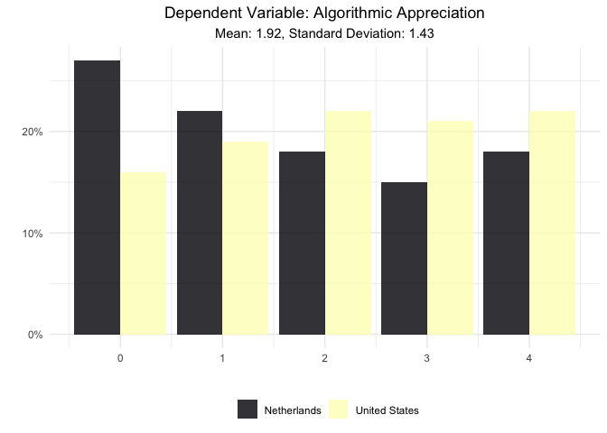
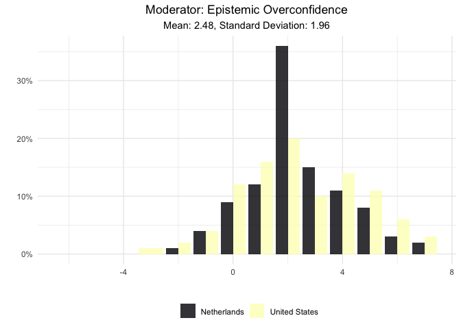

Prepare Data for Epistemic Overconfidence in Algorithmic News Selection
Paper
================

# Scripts

  - [Required Packages &
    Reproducibility](#required-packages-&-reproducibility)
  - [Tidy Data](#tidy-data)
      - [Scalability of Variables](#scalability-of-variables)
      - [Data Wrangling](#data-wrangling)
      - [Check Missing Values](#check-missing-values)
  - [Save Data for Analysis](#save-data-for-analysis)
  - [Visualization of Data](#visualization-of-data)
      - [Dependent Variable](#dependent-variable)
      - [Independent Variable](#independent-variable)
      - [Control Variables](#control-variables)
      - [Correlations Matrix](#correlations-matrix)

## Required Packages & Reproducibility

``` r
rm(list=ls())

renv::snapshot()
```

    ## * The lockfile is already up to date.

``` r
source("../lib/functions.R")
```

## Tidy Data

Load data from the U.S. and the Netherlands.

``` r
nl <- read_csv("../../data/raw-private-encrypted/POLLFISH.csv")
us <- qualtrics("../../data/raw-private-encrypted/US_MTURK.csv") %>%
  mutate(Q1_1 = rename2(Q1_1),
         Q1_2 = rename2(Q1_2),
         Q1_3 = rename2(Q1_3),
         Q1_4 = rename2(Q1_4),
         Q1_5 = rename2(Q1_5),
         Q1_6 = rename2(Q1_6),
         Q1_7 = rename2(Q1_7),
         Q1_8 = rename2(Q1_8),
         Q1_9 = rename2(Q1_9),
         Q1_10 = rename2(Q1_10),
         Q1_11 = rename2(Q1_11),
         Q1_12 = rename2(Q1_12),
         Q1_13 = rename2(Q1_13),
         Q1_14 = rename2(Q1_14),
         Q1_15 = rename2(Q1_15),
         Q1_16 = rename2(Q1_16),
         Q1_17 = rename2(Q1_17),
         Q1_18 = rename2(Q1_18),
         Q1_19 = rename2(Q1_19),
         Q1_20 = rename2(Q1_20),
         Q1_21 = rename2(Q1_21),
         Q1_22 = rename2(Q1_22),
         Q1_23 = rename2(Q1_23),
         Q20_1 = rename1(Q20_1),
         Q20_2 = rename1(Q20_2),
         Q20_3 = rename1(Q20_3),
         Q20_4 = rename1(Q20_4),
         Q20_5 = rename1(Q20_5),
         Q23_1 = rename2(Q23_1),
         Q23_2 = rename2(Q23_2),
         Q23_3 = rename2(Q23_3),
         Q23_4 = rename2(Q23_4),
         Q23_5 = rename2(Q23_5),
         Q23_6 = rename2(Q23_6),
         Q23_7 = rename2(Q23_7),
         Q23_8 = rename2(Q23_8),
         Q23_9 = rename2(Q23_9),
         Q23_1.1 = rename2(Q23_1.1),
         Q23_2.1 = rename2(Q23_2.1),
         Q23_3.1 = rename2(Q23_3.1))
```

### Scalability of Variables

The dependent variable under study – i.e. the dimensions of the Uses and
Gratifications Theory ( *Habit Strength* `hs`, *Surveillance* `surv`,
*Escapism* `esc`, *Passing Time* `pt`, and *Entertainment* `ent`) – as
well as the control variables *news consumtion* `news`, *trust in media*
`trust`, *political efficacy* `polef` are latent constructs. We first
check the scalability of the items that together make up these
variables.

``` r
hs_nl <- nl %>%
  select(ugt_1:ugt_4) %>%
  drop_na() %>%
  psych::fa(rotate="varimax", fm="pa", scores="Bartlett")

hs_us <- us %>%
  select(Q1_1:Q1_4) %>%
  drop_na() %>%
  psych::fa(rotate="varimax", fm="pa", scores="Bartlett")

surv_nl <- nl %>%
  select(ugt_5:ugt_11) %>%
  drop_na() %>%
  psych::fa(rotate="varimax", fm="pa", scores="Bartlett")
  
surv_us <- us %>%
  select(Q1_5:Q1_11) %>%
  drop_na() %>%
  psych::fa(rotate="varimax", fm="pa", scores="Bartlett")

esc_nl <- nl %>%
  select(ugt_12:ugt_16) %>%
  drop_na() %>%
  psych::fa(rotate="varimax", fm="pa", scores="Bartlett")

esc_us <- us %>%
  select(Q1_12:Q1_16) %>%
  drop_na() %>%
  psych::fa(rotate="varimax", fm="pa", scores="Bartlett")

pt_nl <- nl %>%
  select(ugt_17:ugt_21) %>%
  drop_na() %>%
  psych::fa(rotate="varimax", fm="pa", scores="Bartlett")

pt_us <- us %>%
  select(Q1_17:Q1_21) %>%
  drop_na() %>%
  psych::fa(rotate="varimax", fm="pa", scores="Bartlett")

ent_nl <- nl %>%
  select(ugt_22:ugt_23) %>%
  drop_na() %>%
  psych::fa(rotate="varimax", fm="pa", scores="Bartlett")

ent_us <- us %>%
  select(Q1_22:Q1_23) %>%
  drop_na() %>%
  psych::fa(rotate="varimax", fm="pa", scores="Bartlett")

tibble(Country = c(rep("U.S.A.", 5), rep("Netherlands", 5)),
       Scale = rep(c("Habit Strengt", "Surveillance", "Escapism","Passing Time",
                     "Entertainment"), 2),
       `Chi Square` = c(hs_us[3]$chi, surv_us[3]$chi, esc_us[3]$chi, pt_us[3]$chi,
                        ent_us[3]$chi, hs_nl[3]$chi, surv_nl[3]$chi, esc_nl[3]$chi,
                        pt_nl[3]$chi, ent_nl[3]$chi),
       Fit = c(hs_us[10]$fit, surv_us[10]$fit, esc_us[10]$fit, pt_us[10]$fit,
               ent_us[10]$fit, hs_nl[10]$fit, surv_nl[10]$fit,
               esc_nl[10]$fit, pt_nl[10]$fit, ent_nl[10]$fit),
       PA = c(hs_us[29]$R2, surv_us[29]$R2, esc_us[29]$R2, pt_us[29]$R2,
               ent_us[27]$R2, hs_nl[29]$R2, surv_nl[29]$R2,
               esc_nl[29]$R2, pt_nl[29]$R2, ent_nl[27]$R2))
```

| Country     | Scale         | Chi Square |       Fit |        PA |
| :---------- | :------------ | ---------: | --------: | --------: |
| U.S.A.      | Habit Strengt |  5.9759424 | 0.9045072 | 0.8429616 |
| U.S.A.      | Surveillance  | 27.3647018 | 0.8846539 | 0.8909118 |
| U.S.A.      | Escapism      |  2.8170124 | 0.8846109 | 0.9047639 |
| U.S.A.      | Passing Time  |  5.8303108 | 0.9239337 | 0.8902156 |
| U.S.A.      | Entertainment |  0.0001127 | 0.8975023 | 0.7673170 |
| Netherlands | Habit Strengt | 24.2400673 | 0.9110560 | 0.8756922 |
| Netherlands | Surveillance  | 37.7404458 | 0.9512085 | 0.9202703 |
| Netherlands | Escapism      | 11.9880991 | 0.9412254 | 0.9148294 |
| Netherlands | Passing Time  | 13.6334949 | 0.9378988 | 0.9083691 |
| Netherlands | Entertainment |  0.0001068 | 0.9609960 | 0.8587656 |

``` r
rm(hs_us, surv_us, esc_us, pt_us, ent_us, hs_nl, surv_nl, esc_nl, pt_nl, ent_nl)
```

### Data Wrangling

Recode variables and merge US and NL data.

``` r
news_nl <- nl %>%
  select(mediagebruik_1:mediagebruik_9) %>%
  drop_na() %>%
  psy::cronbach()

news_us <- us %>%
  select(Q20_1:Q20_5) %>%
  drop_na() %>%
  psy::cronbach()

trust_nl <- nl %>%
  select(trust_media_1:trust_media_9) %>%
  drop_na() %>%
  psy::cronbach()

trust_us <- us %>%
  select(Q23_1:Q23_9) %>%
  drop_na() %>%
  psy::cronbach()

polef_nl <- nl %>%
  select(pol_efficacy_1:pol_efficacy_5) %>%
  drop_na() %>%
  psy::cronbach()

polef_us <- us %>%
  select(Q23_1.1:Q23_3.1) %>%
  drop_na() %>%
  psy::cronbach()

tibble(Country = c(rep("U.S.A.", 3), rep("Netherlands", 3)),
       Scale = rep(c("News Usage", "Trust in Media", "Political Efficacy"),2),
       `Cronbach's Alpha` = c(news_us[3]$alpha, trust_us[3]$alpha, polef_us[3]$alpha,
                              news_nl[3]$alpha, trust_nl[3]$alpha, polef_nl[3]$alpha))
```

| Country     | Scale              | Cronbach’s Alpha |
| :---------- | :----------------- | ---------------: |
| U.S.A.      | News Usage         |        0.7065999 |
| U.S.A.      | Trust in Media     |        0.8463967 |
| U.S.A.      | Political Efficacy |        0.3608932 |
| Netherlands | News Usage         |        0.8081109 |
| Netherlands | Trust in Media     |        0.8039283 |
| Netherlands | Political Efficacy |        0.5841396 |

``` r
rm(news_us, trust_us, polef_us, news_nl, trust_nl, polef_nl)
```

``` r
nl <-  nl %>%
  mutate(news = round((mediagebruik_1 + mediagebruik_2 + mediagebruik_3 +
                         mediagebruik_4 + mediagebruik_5 + mediagebruik_6 +
                         mediagebruik_7 + mediagebruik_8 +
                        mediagebruik_9)/9, digits = 0),
         hs = round((ugt_1 + ugt_2 + ugt_3 + ugt_4)/4, digits = 0),
         surv = round((ugt_5 + ugt_6 + ugt_7 + ugt_8  + ugt_9  + ugt_10 + 
                         ugt_11)/7, digits = 0),
         esc = round((ugt_12 + ugt_13 + ugt_14 + ugt_15 + ugt_16)/5, digits = 0),
         pt = round((ugt_17 + ugt_18 + ugt_19 + ugt_20 + ugt_21)/5, digits = 0),
         ent = round((ugt_22 + ugt_23)/2, digits = 0),
         algo_app = (rename3(alg_app1_1) + rename3(alg_app2_1) +
                       rename3(alg_app3_1) + rename3(alg_app4_1)),
         trust = round((trust_media_1 + trust_media_2  + trust_media_3 + 
                          trust_media_4 + trust_media_5 + trust_media_6 +
                          trust_media_7 + trust_media_8 + 
                        trust_media_9)/9,digits = 0),
         polef = round((pol_efficacy_1 + pol_efficacy_2 + pol_efficacy_5)/3, 
                       digits = 0),
         DK1 = str_to_lower(DK1, locale = "nl"),
         DK1 = ifelse(DK1 == "2", 1,
               ifelse(DK1 == "2e", 1,
               ifelse(DK1 == "2de", 1,
               ifelse(DK1 == "2de plaats", 1,
               ifelse(DK1 == "2e plaats",1,
               ifelse(DK1 == "de tweede", 1,
               ifelse(DK1 == "de tweede plaats", 1,
               ifelse(DK1 == "in de tweede plaats", 1,
               ifelse(DK1 == "op de tweede plaats", 1,
               ifelse(DK1 == "plek 2", 1,
               ifelse(DK1 == "tweede", 1, 0))))))))))),
         DK2 = ifelse(DK2 == "8", 1,
               ifelse(DK2 == "8 schapen", 1,
               ifelse(DK2 == "8 schapwn", 1,
               ifelse(DK2 == "Acht", 1, 0)))),
         DK3 = str_to_lower(DK3),
         DK3 = ifelse(DK3 == "emily", 1,
               ifelse(DK3 == "emilu", 1,
               ifelse(DK3 == "emily's", 1,
               ifelse(DK3 == "emily s", 1, 0)))),
         DK4 = str_to_lower(DK4),
         DK4 = ifelse(DK4 == "0", 1,
               ifelse(DK4 == "0 als het een gat is waar geen vuil in zit", 1,
               ifelse(DK4 == "een gat is leeg", 1,
               ifelse(DK4 == "gat is leeg, dus geen vuil", 1,
               ifelse(DK4 == "geen vuil, want het is een gat", 1,
               ifelse(DK4 == "geen, want het is een gat", 1, 
               ifelse(DK4 == "nee", 1,
               ifelse(DK4 == "niets", 1,
               ifelse(DK4 == "nul", 1, 0))))))))),     
         DK5 = ifelse(DK5 == ".05", 1,
               ifelse(DK5 == "£0,05", 1,
               ifelse(DK5 == "€0,05", 1,
               ifelse(DK5 == "€0.05", 1,
               ifelse(DK5 == "0,05", 1,
               ifelse(DK5 == " 0,05 aangezien ik de koers van euro 1,10 naar dollar niet weet kan ik dit niet met zekerheid zeggen", 1, 
               ifelse(DK5 == "0,05 dollar", 1,
               ifelse(DK5 == "0,05 eurocent", 1,
               ifelse(DK5 == "0.05", 1,
               ifelse(DK5 == "5 cent", 1,
               ifelse(DK5 == "5 dollar cent", 1,
               ifelse(DK5 == "Ik ken de wisselkoers van Euro naar Dollar en vice versa op het moment niet. Maar er vanuit gaande dat er maar met een soort valuta mag worden gerekend dan kost de bal: 5 cent.",1,
                      0)))))))))))),
         DK6 = str_to_lower(DK6),
         DK6 = ifelse(DK6 == "5 min", 1,
               ifelse(DK6 == "5 min.", 1,
               ifelse(DK6 == "5 minuten", 1,
               ifelse(DK6=="5min", 1,
               ifelse(DK6=="5minuten", 1,
               ifelse(DK6=="vijf", 1, 0)))))),
         DK7 = str_to_lower(DK7),
         DK7 = str_replace(DK7, "47", "1"),
         DK7 = ifelse(DK7 == "1", 1, 0),
         correct = (DK1 + DK2 + DK3 + DK4 + DK5 + DK6 + DK7),
         eo = Overconfidence - correct,
         gender = recode(Gender, `0` = "Male", `1` = "Female", `99` = "Other"),
         gender = na_if(gender, "Other"),
         gender = factor(gender, levels = c("Female", "Male")),
         age = Age,
         age = na_if(age, "812"),
         age = na_if(age, "a"),         
         age = na_if(age, "asd"),
         age = na_if(age, "Dbn"),
         age = na_if(age, "eg"),
         age = na_if(age, "Gcc"),
         age = na_if(age, "i"),
         age = na_if(age, "Ja"),
         age = na_if(age, "nee"),
         age = na_if(age, "yes"),
         age = na_if(age, "Zek"),
         age = as.numeric(age),
         ResponseId = V1,
         country = "Netherlands",
         pid = "None"
         ) %>%
  select(ResponseId, country, news, hs, surv, esc, pt, ent, 
         algo_app, trust, polef, eo, gender, age, pid) %>%
  filter(age >17)

us <-  us %>%
  mutate(news = round((Q20_1 + Q20_2 + Q20_3 + Q20_4 + Q20_5)/5, digits = 0),
         hs = round((Q1_1 + Q1_2 + Q1_3 + Q1_4)/4, digits = 0),
         surv = round((Q1_5 + Q1_6 + Q1_7 + Q1_8 + Q1_9 + Q1_10 +
                         Q1_11)/7, digits = 0),
         esc = round((Q1_12 + Q1_13 + Q1_14 + Q1_15 + Q1_16)/5, digits = 0),
         pt = round((Q1_17 + Q1_18 + Q1_19 + Q1_20 + Q1_21)/5, digits = 0),
         ent = round((Q1_22 + Q1_23)/2, digits = 0),
         algo_app = (rename3(Q3_1) + rename3(Q4_1) + rename3(Q6_1) +
                       rename3(Q8_1)),
         trust = round((Q23_1 + Q23_2 + Q23_3 + Q23_4 + Q23_5 + Q23_6 + Q23_7 +
                          Q23_8 + Q23_9)/9, digits = 0),
         polef = round((Q23_1.1 + Q23_2.1 + Q23_3.1)/3, digits = 0),
         Q11 = str_to_lower(Q11, locale = "en"),
         Q11 = ifelse(Q11 == "second", 1,
               ifelse(Q11 == "second place", 1,
               ifelse(Q11 == "2", 1,
               ifelse(Q11 == "2nd", 1,
               ifelse(Q11 == "second place. if you guessed first place, the person in first place is still there.",
                       1, 0))))),
         Q12 = ifelse(Q12 == "8", 1, 0),
         Q14 = str_to_lower(Q14),
         Q14 = ifelse(Q14 == "emily", 1,
               ifelse(Q14 == "emily april may", 1, 0)),
         Q15 = str_to_lower(Q15),
         Q15 = ifelse(Q15 == "0", 1,
               ifelse(Q15 == "0 cubic feet", 1,
               ifelse(Q15 == "none", 1,
               ifelse(Q15 == "zero", 1,
               ifelse(Q15 == "there is no dirt in a hole", 1,
               ifelse(Q15 == "there's no dirt in a hole", 1, 0)))))),     
         Q16 = ifelse(Q16 == ".05", 1,
               ifelse(Q16 == "$0.05", 1,
               ifelse(Q16 == "0.05", 1,
               ifelse(Q16 == "05", 1,
               ifelse(Q16 == "5", 1,
               ifelse(Q16 == "5 cents", 1, 0)))))),
         Q17 = str_to_lower(Q17),
         Q17 = str_replace(Q17, "5", "1"),
         Q17 = ifelse(Q17 == "1", 1, 0),
         Q18 = str_to_lower(Q18),
         Q18 = str_replace(Q18, "47", "1"),
         Q18 = ifelse(Q18 == "1", 1, 0),
         correct = (Q11 + Q12 + Q14 + Q15 + Q16 + Q17 + Q18),
         eo = Q19 - correct,
         pid = Q31,
         pid = recode(Q31, "Independent"= "Other", "Something Else" = "Other"),
         pid = factor(pid, levels = c("Other", "Democrat", "Republican")),
         gender = Q37,
         gender = recode(Q37, "Transgender Female" = "Female"),
         gender = na_if(gender, "Prefer not to answer"),
         gender = factor(gender, levels = c("Female", "Male")),
         age = (2019 - Q39),
         country = "United States"
         ) %>%
  select(ResponseId, country, news, hs, surv, esc, pt, ent, 
         algo_app, trust, polef, eo, pid, gender, age)

df <- nl %>%
  add_row(us)
rm(nl, us)
```

### Check Missing Values

We employ the following criteria:

  - If 10% or less of the values on the dimension are missing, then we
    re-code the missing values to the overall mean.
  - If 11% or more of the values on the dimension are missing, then we
    re-code the missing values to a constant (for instance 0) and
    include a dummy variable indicating whether the response on the
    covariate was missing or not.

<!-- end list -->

``` r
df %>%
  group_by(country) %>%
  summarise(`Algorithmic Appreciation` = round(sum(is.na(algo_app))/n(),2),
            `UGT: Entertainment` = round(sum(is.na(ent))/n(),2),
            `UGT: Escapism` = round(sum(is.na(esc))/n(),2),
            `UGT: Habit Strength` = round(sum(is.na(hs))/n(),2),
            `UGT: Passing Time` = round(sum(is.na(pt))/n(),2),
            `UGT: Surveillance` = round(sum(is.na(surv))/n(),2),
            `Epistemic Overconfidence` = round(sum(is.na(eo))/n(),2),
            `Age` = round(sum(is.na(age))/n(),2),
            `Gender` = round(sum(is.na(gender))/n(),2),
            `Party ID` = round(sum(is.na(pid))/n(),2),
            `News Usage` = round(sum(is.na(news))/n(),2),
            `Political Efficacy` = round(sum(is.na(polef))/n(),2),
            `Trust in Media` = round(sum(is.na(trust))/n(),2)) %>%
  pivot_longer(cols = `Algorithmic Appreciation`:`Trust in Media`,
              names_to = "Variables", values_to = "% Missing Values")
```

| country       | Variables                | % Missing Values |
| :------------ | :----------------------- | ---------------: |
| Netherlands   | Algorithmic Appreciation |             0.00 |
| Netherlands   | UGT: Entertainment       |             0.01 |
| Netherlands   | UGT: Escapism            |             0.01 |
| Netherlands   | UGT: Habit Strength      |             0.01 |
| Netherlands   | UGT: Passing Time        |             0.01 |
| Netherlands   | UGT: Surveillance        |             0.01 |
| Netherlands   | Epistemic Overconfidence |             0.17 |
| Netherlands   | Age                      |             0.00 |
| Netherlands   | Gender                   |             0.02 |
| Netherlands   | Party ID                 |             0.00 |
| Netherlands   | News Usage               |             0.00 |
| Netherlands   | Political Efficacy       |             0.00 |
| Netherlands   | Trust in Media           |             0.00 |
| United States | Algorithmic Appreciation |             0.00 |
| United States | UGT: Entertainment       |             0.00 |
| United States | UGT: Escapism            |             0.00 |
| United States | UGT: Habit Strength      |             0.00 |
| United States | UGT: Passing Time        |             0.00 |
| United States | UGT: Surveillance        |             0.00 |
| United States | Epistemic Overconfidence |             0.04 |
| United States | Age                      |             0.07 |
| United States | Gender                   |             0.07 |
| United States | Party ID                 |             0.07 |
| United States | News Usage               |             0.00 |
| United States | Political Efficacy       |             0.00 |
| United States | Trust in Media           |             0.00 |

For the Dutch data, we recode the missing values of the variables `UGT:
Entertainment`, `UGT: Escapism`, `UGT: Habit Strength`, `UGT: Passing
Time`, `UGT: Surveillance`, and `Gender` to the mean value of the
respective variables. For the variable `Epistemic Overconfidence` we
additionally add a dummy variable indicating whether this variable was
missing. For the U.S. data, we recode the missing values of the
variables `Epistemic Overconfidence`, `Party ID`,`Gender`, and `Age` to
the mean value of the respective variables.

``` r
means <- df %>%
  group_by(country) %>%
  summarise(ent = mean(ent, na.rm = T),
            esc = mean(esc, na.rm = T),
            hs = mean(hs, na.rm = T),
            pt = mean(pt, na.rm = T),
            surv = mean(surv, na.rm = T),
            eo = mean(eo, na.rm = T),
            age = mean(age, na.rm = T),
            gender = max(names(table(gender))),
            pid = max(names(table(pid))))

df <- df %>%
  mutate(ent = ifelse(country == "Netherlands" & is.na(ent), means$ent[1], ent),
         esc = ifelse(country == "Netherlands" & is.na(esc), means$esc[1], esc),
         hs = ifelse(country == "Netherlands" & is.na(hs), means$hs[1], hs),
         pt = ifelse(country == "Netherlands" & is.na(pt), means$pt[1], pt),
         surv = ifelse(country == "Netherlands" & is.na(surv), means$surv[1],
                       surv),
         gender = as.character(gender),
         gender = ifelse(country == "Netherlands" & is.na(gender), 
                         means$gender[1], gender),
         gender = ifelse(country == "United States" & is.na(gender),
                         means$gender[2], gender),
         missing_eo = ifelse(country == "Netherlands" & is.na(eo), 1, 0),
         eo = ifelse(country == "Netherlands" & is.na(eo), means$eo[1], eo),
         eo = ifelse(country == "United States" & is.na(eo), means$eo[2], eo),
         pid = ifelse(country=="United States"  & is.na(pid), means$pid[2], pid),
         age = ifelse(country=="United States" & is.na(age), means$age[2], age)
         )
rm(means)
```

## Save Data for Analysis

``` r
save(df, file = "../../data/intermediate/cleaned_data.RData")
```

## Visualization of Data

### Dependent Variable

<!-- -->

### Independent Variable

<!-- -->

### Moderator

<!-- -->

### Control Variables

<!-- -->

### Correlations Matrix

<!-- -->
